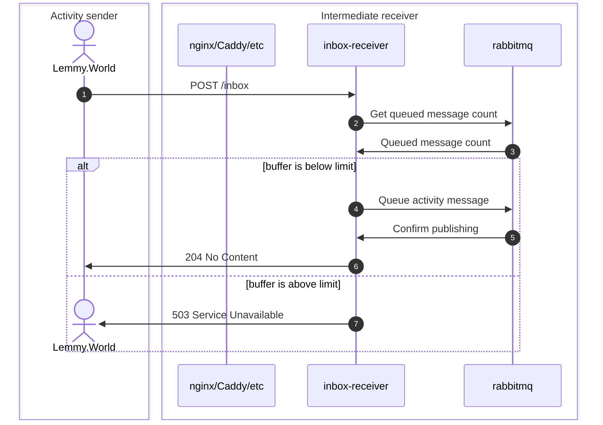
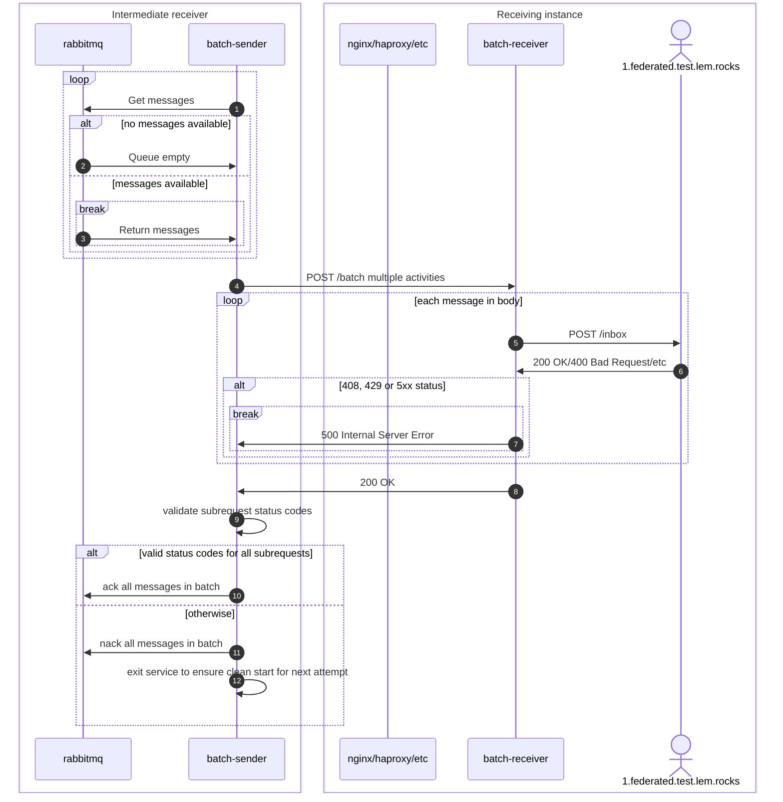

# activitypub-federation-queue-batcher

This application collects activities from an ActivityPub server and forwards them in batches to your own ActivityPub server, where they're getting split back into individual requests to conform to the ActivityPub protocol.

## Why?

ActivityPub sends activities one at a time, and some software (such as Lemmy) will wait for the first activity to be accepted before sending the next one. If a large instance such as Lemmy.World generates a lot of activities, and your server has a high ping to their server (perhaps due to being on the other side of the world), then this can lead to a situation where the federation can't keep up. By batching activities together you can send them across the world in one go, reducing the impact of the high ping, as this reduces the latency overhead by reducing the number of high latency requests.

Lemmy currently also still depends on certain activities being received in the correct order, so while one option would be to just forward activities in parallel, this application ensures that all activities are still received in the same order they've been sent in. This is not required but ActivityPub, but Lemmy currently still depends on this. Some other ActivityPub implementations might have similar expectations.

## Prerequisites

In order to deploy this, you will need a few things:

- Direct server access to your ActivityPub instance server (e.g. your Lemmy server VPS). We will refer to this as your 'Lemmy server'. In theory, it can be any ActivityPub instance, but it has only been tested with Lemmy, and some of the configuration examples are specific to Lemmy.
- A second VPS close to the instance that is sending the activities (such as a server in Helsinki, Finland for Lemmy.World). We will refer to this as 'your VPS'.
- Access to someone running the instance you are having trouble with, so they can redirect their traffic to your VPS (e.g. with a hosts file entry).

# Installation

To set this up, there are three steps.

1. Install the batch-receiver into your Lemmy server.
2. Set up a proxy, inbox-receiver and batch-sender on your VPS, for example with the provided Ansible playbook. This guide will assume that you use the Ansible playbook.
3. Ask the system administrator of the instance you can't keep up with to send activities for your instance to your VPS

## Installing the batch-receiver

The batch-receiver can be added to your existing docker compose stack or as a separate container. You can use the [example docker-compose.yml file](https://github.com/Nothing4You/activitypub-federation-queue-batcher/blob/main/examples/back/docker-compose.yml) as a start or simply use it as is and adjust the parts described in the next step.

Make sure you update the secret to a long random string, then start this container. You can securely generate a secret by running `openssl rand -base64 32`.

Next, to send content to the batch-receiver, we will update the Lemmy reverse proxy to send any requests to `/batch` to the batch-receiver.

In a standard lemmy-ansible deployment, this configuration will be in `nginx_internal.conf`. Add the following snippet in the server section if running in the same stack as Lemmy:

```
set $batch "batch-receiver:8080";
location = /batch {
    proxy_pass "http://$batch";
}
```

Or swap the service name for the container name if running in a separate stack, similar to the following. Make sure you have given the batch-receiver access to the network that Lemmy's nginx runs on.

```
set $batch "batcher-batch-receiver-1:8080";
location = /batch {
    proxy_pass "http://$batch";
}
```

Reload/restart nginx and try accessing https://yourinstance.com/batch. You should receive a 405 error because it's not a valid request, not a 502 or some other error. If you get a 502, see [Batch receiver not found](#batch-receiver-not-found).

If you receive a 405 error, the batch-receiver is ready.

## Run the Ansible playbook on the VPS

The next step is to run the Ansible playbook on the VPS. Be careful if there is already something else running on the VPS, it may make more sense to do it manually. These instructions assume your local device is running Linux.

### Set up configuration

Clone this repository to your local machine, for example by running `https://github.com/Nothing4You/activitypub-federation-queue-batcher.git`, then go to `examples/front`.

Copy `inventory.yml.example` to `inventory.yml` and edit it following the template. Update at least the following values:

- `ansible_host`: the IP address of your VPS (not Lemmy server)
- `domain`: Your Lemmy instance host name (or ActivityPub instance)
- `upstream`: Protocol and host name of your instance
- `batch_authorization`: The secret you used for your batch-receiver

You also need to update the details of the instance that you will be receiving traffic from (e.g. Lemmy.world) in `batch_instances`, including the IP address they send from (you can find this in your access logs). You should also add your own IP while testing initially, so you can send a test activity.

Before you run the playbook, we need to sort out the TLS certificate, as the remote server will need to connect securely to the VPS, thinking it is connecting to your Lemmy server. In the case that the DNS entry points at your VPS, you can run the playbook, and it will automatically sort out TLS, but this is typically limited to dev environments. Most likely your domain points at your Lemmy server, so you will need to intervene.

### Option 1: Copy a static TLS certificate to your VPS

`TODO` Add instructions here.

This method does not automatically renew the certificate prior to expiration, so you'll need to take care of that yourself.

### Option 2: Cloudflare

To have certbot use the DNS challenge (since your domain doesn't actually point at the extra VPS), log in to your Cloudflare dashboard and create an API token with `Zone:DNS:Edit` permission for the zone you need a certificate for. We will use the certbot Cloudflare plugin, documentation for this is [here](https://certbot-dns-cloudflare.readthedocs.io/en/stable/#credentials).

Uncomment the variable `certbot_cloudflare_api_key` in your inventory and insert the API token.

### Running the Ansible playbook

Now you can run the playbook. On your local machine, run (from the terminal) while in the `examples/front` directory:

`ansible-playbook -u root playbook.yml`

This assumes you have SSH key authentication set up for logging in as the root user.

### Send a test activity

```bash
# set your instance domain
instance_domain="myinstance.tld"
# set your vps IP of the proxy vps
batch_vps=10.20.30.40

curl -4 --resolve "$instance_domain:443:$batch_vps" -v -H "host: $instance_domain" -H "content-type: application/activity+json" -H "date: Sun, 30 Jun 2024 21:47:56 GMT" -H "digest: SHA-256=cm7gbBbbUrLuk+bwtDtKO0s2WRYteHx1k0U4Ta4aYm8=" -H 'signature: keyId="https://lemmy.world/c/artshare#main-key",algorithm="hs2019",headers="(request-target) content-type date digest host",signature="aWtPWHjGj76TAtu5JPKaike7pFCc0IAeXc2CyfDeVwRUmu235IRnq/ECXXeSNsnqKKJWo7I8UHQsd3Vkf1jGO0SI+Pw1SQBh/IF38uQPzhbyYK60CCNZ8C4V7zCw/oQ5n46AtMaPX8K8qmCJrSQmOLcUl2AZTatHBvHdpDGy1uDjHZtISrkV50W+Ck7E87dxTDeqIluLhP/XTiSio2PJpmErDwuyk7103vQUTSLO0ob9Q9K4LHsB/KUVbFrNBaiCp0MeiWGHF94exRWYGv64HXWfbs7J5lPdyLqvm9Qg9Ck9HG8uKpNiDL3MM8TudLqSTppuLyfNKaJFR1WF4/APNg=="' -H "accept: */*" -H "user-agent: Lemmy/0.19.3; +https://lemmy.world" "https://$instance_domain/inbox" --data-raw '{"@context":["https://join-lemmy.org/context.json","https://www.w3.org/ns/activitystreams"],"actor":"https://lemmy.world/c/artshare","to":["https://www.w3.org/ns/activitystreams#Public"],"object":{"id":"https://lemmy.world/post/17092799","actor":"https://lemmy.world/u/dirk82","type":"Page","attributedTo":"https://lemmy.world/u/dirk82","to":["https://lemmy.world/c/artshare","https://www.w3.org/ns/activitystreams#Public"],"name":"Marker on photo paper","cc":[],"mediaType":"text/html","attachment":[{"href":"https://lemmy.world/pictrs/image/2d367c48-ae46-4d17-b713-7605159d3788.jpeg","type":"Link"}],"image":{"type":"Image","url":"https://lemmy.world/pictrs/image/0aa14402-8722-42c9-b90e-9cf2c2814436.jpeg"},"commentsEnabled":true,"sensitive":false,"published":"2024-06-30T21:47:40.677535Z","language":{"identifier":"en","name":"English"},"audience":"https://lemmy.world/c/artshare"},"cc":["https://lemmy.world/c/artshare/followers"],"type":"Announce","id":"https://lemmy.world/activities/announce/page/30ff7154-b985-4ba0-bcda-308338cbbdc2"}'
```

Check the logs of `inbox-receiver`, which should show that the activity was accepted and queued.

Then check the logs of `batch-receiver` on your Lemmy instance server. This should show that the activity was received, but rejected by lemmy (HTTP 400 error, because the signature is invalid).

It should also show in the Lemmy logs with a warning, stating 'Signature is expired'.

If it's all looking good, proceed to pointing traffic at it.

## Ask the sending instance to direct their traffic to your new VPS

Once everything is set up, get in contact with someone with server access to the instance you can't keep up with and have them update the hosts file to point your instance hostname at the VPS IP instead of the instance server.

This should start sending traffic to the inbox receiver, and everything should flow through to Lemmy.

Watch the batch-receiver logs to make sure everything is looking ok.

# Notes

- It is highly recommended to pin specific container tags and not use the `latest` tag
- You'll probably want to run an instance of inbox-receiver and batch-sender for each sending instance where you need to speed up federation
  - each set will need its own `RABBITMQ_CHANNEL_ROUTING_KEY` defined
- A single batch-receiver can handle multiple batch senders
- Don't run multiple batch-sender instances with the same `RABBITMQ_CHANNEL_ROUTING_KEY` or you'll get activities out of order
- Preliminary validation of traffic is strongly recommended to ensure it doesn't lock up
- Activities without id will not be accepted, instead 503 Service Unavailable will be returned.
  This is a safety measure to avoid dropping such activities should we ever encounter them.
  Lemmy does not appear to support activities without id, but [the specification](https://www.w3.org/TR/activitypub/#server-to-server-interactions) seems to allow them in some cases.

# Risks of running this software

This software is built in a way that there should not be any loss of activities possible without disk failure or manual intervention, e.g. deleting docker volumes. Nevertheless, there are still some situations that can interfere with these goals.

You may want to look at [Re-sending activities from Lemmy](#Re-sending-activities-from-Lemmy) if you risk losing activities.

## Backend is down for an extended period of time

Activities have a signature attached to them. This signature is only valid for a limited amount of time, in Lemmy 0.19.3 this is one hour. If activities are accepted and not able to be delivered to the destination the signature expires and the activities will be rejected by the receiving software. As the original sender already received an acknowledgement by the inbox-receiver, there will be no retries for these activities.

It is recommended to stop inbox-receiver and wait for the queue to be empty (follow batch-sender logs) prior to any planned maintenance with extended downtime.

## Inbox-receiver is not accepting activities

If activities are not accepted by inbox-receiver, the sending instance _should_ be retrying to send them at a later point. Not all software implements retrying activities, so this might lead to loss of activities, but this wouldn't be any different from regular downtime of your ActivityPub application. Lemmy 0.19+ will retry sending activities for several failure conditions.

# Troubleshooting

## Batch receiver not found

If you get an nginx error along the lines of `no resolver defined to resolve batcher-batch-receiver-1` you should ensure that you define a [`resolver`](https://nginx.org/en/docs/http/ngx_http_core_module.html#resolver) in your nginx configuration. For nginx running in a Docker container you'll typically want to use Docker's DNS service by including `resolver 127.0.0.11;` in an appropriate place in the nginx configuration.

## Cloudflare error regarding Cloudflare tokens

If you get an error about a missing API key or missing email address when you are using a token not an API key, then check the cloudflare package is recent enough. You may need to check the operating system is new enough. These instructions have been tested on Ubuntu 22.04+, earlier versions use an older version of a python library that is no longer compatible with the Cloudflare API used with Certbot.

## Error about docker when running Ansible playbook

When running the Ansible playbook, you might get an error `ERROR! couldn't resolve module/action 'community.docker.docker_compose_v2`.

On your local machine, run:

`ansible-galaxy collection install --upgrade community.docker`

## Re-sending activities from Lemmy

If you have activities queued that already expired, it may be desirable to try to reach out to the sending instance to re-send failed activities.

You'll want to stop your inbox-receiver and batch-sender, then empty the queue using the rabbitmq management interface by forwarding the port to your local machine and logging in as `guest:guest`.

You can take the first activity from the queue (first line after the failed `Processing batch of xx messages` log line in batch-sender) or by pulling the first message from the rabbitmq queue through the management interface and extracting it from the json content.

On the sending side, for Lemmy this is fairly simple, at least if federation sending is running in a dedicated container. You can ask the sending instance admin to look up the numeric id of the activity in their `sent_activity` table from the activity id URL, then set the `last_successful_id` for your instance in `federation_queue_state` table to 1 below the activity looked up in the first place. This needs to be done while the Lemmy federation process is stopped, otherwise the value will be overridden with what Lemmy has cached in memory. Since the federation process is only taking care of sending activities to other instances there won't be noticeable user impact from stopping the container for a minute.

## I want to disable it

If you want to disable it, stop the inbox-receiver first. The server will start rejecting traffic from the sending instance, and will clear out the queue. Then you can ask the sending instance to remove the hosts file entry. By clearing the queue first, you prevent activities being received out of order.

## Diagrams




