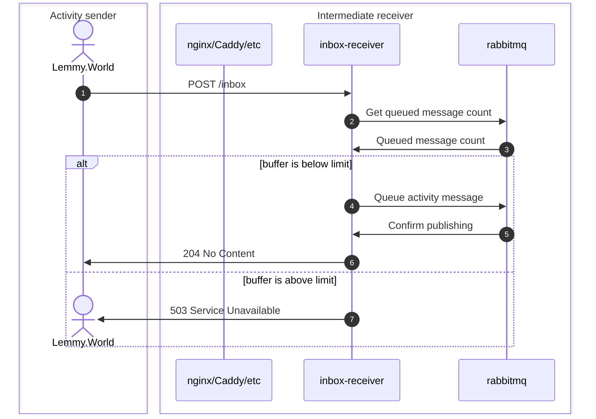
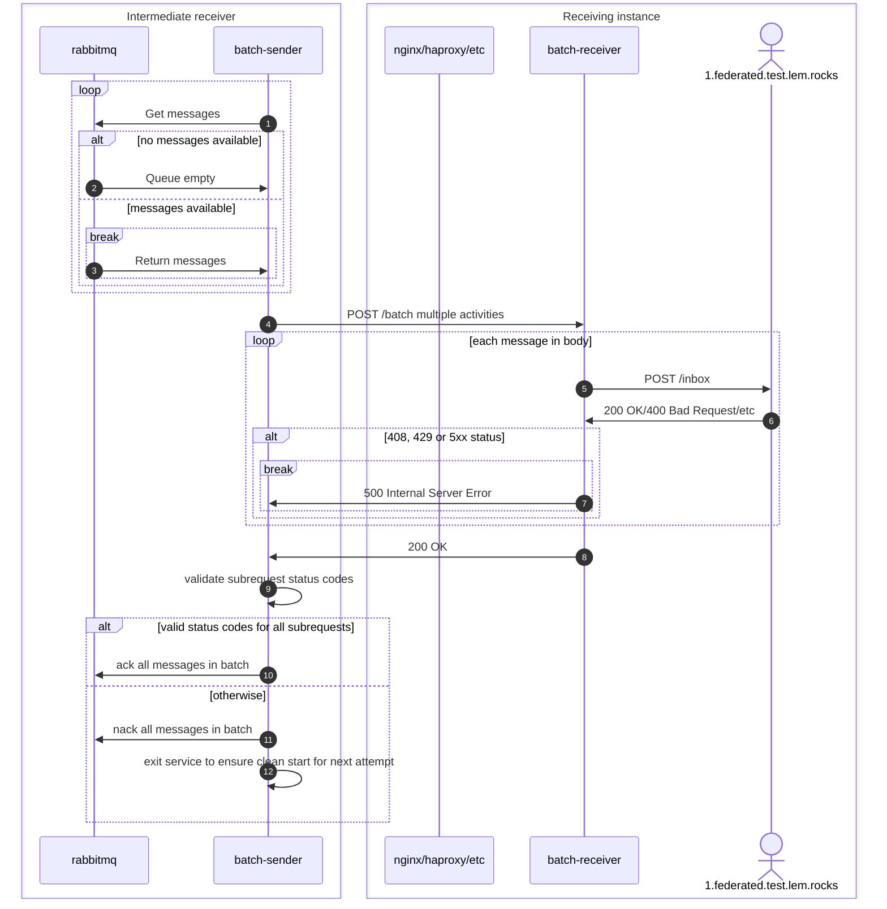

# activitypub-federation-queue-batcher

This is a federation batcher that receives ActivityPub activities from an external server, batches them together, and sends them to your server as a group.

## Why?

ActivityPub sends activities one at a time, and some software (such as Lemmy) will wait for the first activity to be accepted before sending the next one. If a large instance such as Lemmy.world generates a lot of activities, and your server has a high ping to their server (perhaps due to being on the other side of the world), then this can lead to a situation where the federation can't keep up. By batching activities together you can send them across the world in one go, reducing the impact of the high ping.

## Prerequisites

In order to deploy this, you will need a few things:

- Direct server access to your ActivityPub instance server (e.g. your Lemmy server VPS). We will refer to this as your 'Lemmy server'. In theory, it can be any ActivityPub instance, but it has only been tested with Lemmy.
- A second VPS close to the instance you are having trouble with (Such as a server in Helsinki, Finland for Lemmy.world). We will refer to this as 'your VPS'.
- Access to someone running the instance you are having trouble with, so they can redirect their traffic to your VPS (e.g. with a hosts file entry).

# Installation

To set this up, there are three steps.

1. Install the batch-receiver into your Lemmy server.
2. Run an ansible playbook to set up your VPS
3. Ask the system administrator of the instance you can't keep up with to point activities for your instance to your VPS

## Installing the batch-receiver

The batch-receiver can be added to your current docker stack or as a separate docker compose file. Copy the [example docker-compose.yml file](https://github.com/Nothing4You/activitypub-federation-queue-batcher/blob/main/examples/back/docker-compose.yml).

Make sure you update the secret to a long random string, then start this container.

Next, to send content to the batcher, we will update the Lemmy reverse proxy to send any requests to `/batch` to the batch-receiver.

In the `nginx.conf` file, add the following snippet in the server section if running in the same stack as Lemmy:

```
set $batch "batch-receiver:8080";
location = /batch {
    proxy_pass "http://$batch";
}
```

Or swap the service name for the container name if running in a separate stack, similar to the following. Make sure you have given the batch-receive access to the network that Lemmy's nginx runs on.

```
set $batch "batcher-batch-receiver-1:8080";
location = /batch {
    proxy_pass "http://$batch";
}
```

Restart nginx and try accessing https://yourlemmyinstance.com/batch. You should receive a 405 because it's not a valid request, not a 502 or some other error. If you get a 502, see [Batch receiver not found](#batch-receiver-not-found).

If you receive a 405, the batch-receiver is ready.

## Run the ansible playbook on the VPS

The next step is to run the ansible playbook on the VPS. Be careful if there is already something on the VPS, it may make more sense to do it manually. These instructions assume your local device is running Linux.

### Set up configuration

Clone the `activitypub-federation-queue-batcher` repo to your local machine, then go to `examples/front`.

Copy `inventory.yml.example` to `inventory.yml` and edit it following the template. Update the following values:

- `ansible_host`: the IP address of your VPS (not Lemmy server)
- `domain`: Your Lemmy instance host name (or ActivityPub instance)
- `upstream`: Protocol and host name of your instance
- `batch_authorization`: The secret you used for your batch-receiver

You also need to update the details of the instance that you will be receiving traffic from (e.g. Lemmy.world), including the IP address they send from (you can find this in your access logs). You should also add your own IP, so you can send a test activity.

Before you run the playbook, we need to sort out the TLS certificate, as the remote server will need to connect securely with the VPS thinking it is connecting to your Lemmy server. In the case that the DNS entry points at your VPS, you can run the playbook, and it will automatically sort out TSL. However, most likely your domain points at your Lemmy server, so you will need to intervene.

### Option 1: Copy TSL certificate to your VPS

`TODO` Add instructions here

### Option 2: Cloudflare

To have certbot use the DNS challenge (since your domain doesn't actually point at the extra VPS), log in to your Cloudflare dashboard and create an API token with `Zone:DNS:Edit` permission for the zone you need a certificate for. We will use the certbot Cloudflare plugin, documentation for this is [here](https://certbot-dns-cloudflare.readthedocs.io/en/stable/#credentials).

On your local machine create a file `cloudflare.ini` and add the token in the following format:

```
# Cloudflare API token used by Certbot
dns_cloudflare_api_token = [token generated in Cloudflare dashboard]
```

`TODO` Confirm the correct playbook to run here

Now you can run the playbook. On your local machine, run (from the terminal) while in the `example/back` directory:

`ansible-playbook -u root playbook.yml`

This assumes you have SSH key authentication set up for logging in as the root user.

### Send a test activity

`TODO` add example activity and instructions on testing it

Check the logs of `inbox-receiver`, which should have showed it accepted and queued the activity.

Then check the logs of `batch-receiver` on your Lemmy instance server. This should show that the activity was received, but rejected by lemmy (HTTP 400 error, because the signature is invalid).

It should also show in the Lemmy logs with a warning, stating 'Signature is expired'.

If it's all looking good, proceed to pointing traffic at it.

## Ask the problem instance to direct their traffic to your new VPS

Once everything is set up, get in contact with someone with server access to the instance you can't keep up with and have them update the hosts file to point your instance hostname at the VPS IP instead of the instance server.

This should start sending traffic to the batcher, and everything should flow through to Lemmy.

Watch the batch-receiver logs to make sure everything is looking ok.

# Notes

- it is highly recommended to pin specific container tags and not use the `latest` tag
- you'll probably want to run an instance of inbox-receiver and batch-sender for each sending instance where you need to speed up federation
  - each set will need its own `RABBITMQ_CHANNEL_ROUTING_KEY` defined
- a single batch-receiver can handle multiple batch senders
- don't run multiple batch-sender instances with the same `RABBITMQ_CHANNEL_ROUTING_KEY` or you'll get activities out of order
- preliminary validation of traffic is strongly recommended to ensure it doesn't lock up
- Activities without id will not be accepted, instead 503 Service Unavailable will be returned.
  This is a safety measure to avoid dropping such activities should we ever encounter them.
  Lemmy does not appear to support activities without id, but [the specification](https://www.w3.org/TR/activitypub/#server-to-server-interactions) seems to allow them in some cases.

# Troubleshooting

## Batch receiver not found

If you get an nginx error along the lines of `no resolver defined to resolve batcher-batch-receiver-1` then you can update the nginx configuration on your Lemmy server to remove the variable.

Change:

```
set $batch "batch-receiver:8080";
location = /batch {
    proxy_pass "http://$batch";
}
```

To:

```
location = /batch {
    proxy_pass "http://batch-receiver:8080";
}
```

## Cloudflare error regarding Cloudflare tokens

If you get an error about a missing API key or missing email address when you are using a token not an API key, then check the cloudflare software is up-to-date. You may need to check the operating system is new enough. For Ubuntu, make sure you are on Ubuntu 22.04 or later.

## Error about docker when running ansible playbook

When running the ansible playbook, you might get an error `ERROR! couldn't resolve module/action 'community.docker.docker_compose_v2`.

On your local machine, run:

`ansible-galaxy collection install --upgrade community.docker`

## I want to disable it

If you want to disable it, stop the inbox-receiver first. The server will start rejecting traffic from the sending instance, and will clear out the queue. Then you can ask the sending instance to remove the hosts file entry. By clearing the queue first, you prevent activities being received out of order.

## Diagrams




