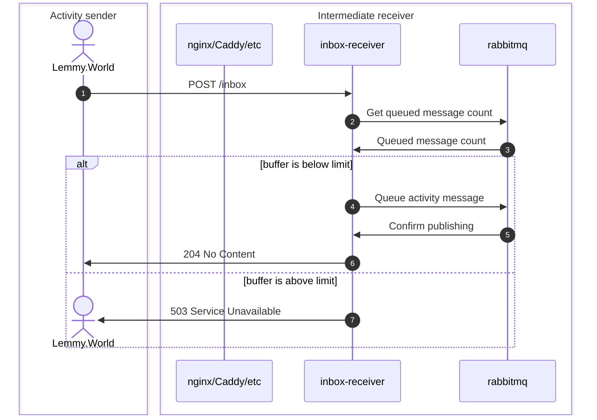
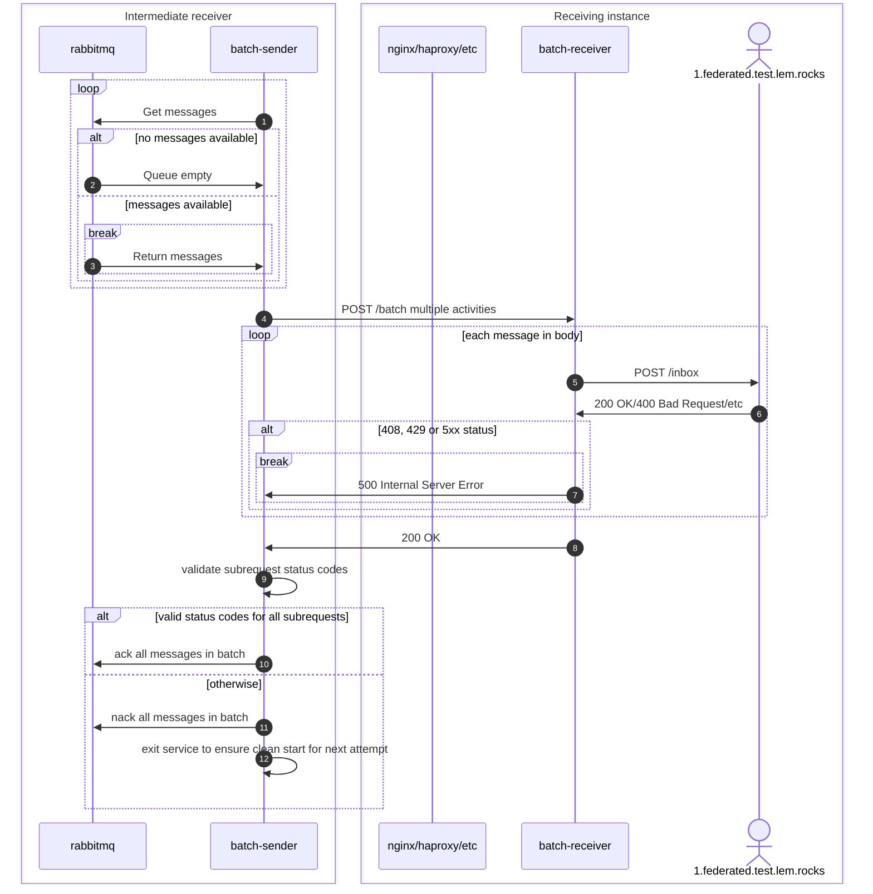

# activitypub-federation-queue-batcher

- it is highly recommended to pin specific container tags and not use the `latest` tag
- you'll probably want to run an instance of inbox-receiver and batch-sender for each sending instance where you need to speed up federation
  - each set will need its own `RABBITMQ_CHANNEL_ROUTING_KEY` defined
- a single batch-receiver can handle multiple batch senders
- don't run multiple batch-sender instances with the same `RABBITMQ_CHANNEL_ROUTING_KEY` or you'll get activities out of order
- preliminary validation of traffic is strongly recommended to ensure it doesn't lock up
- Activities without id will not be accepted, instead 503 Service Unavailable will be returned.
  This is a safety measure to avoid dropping such activities should we ever encounter them.
  Lemmy does not appear to support activities without id, but [the specification](https://www.w3.org/TR/activitypub/#server-to-server-interactions) seems to allow them in some cases.

